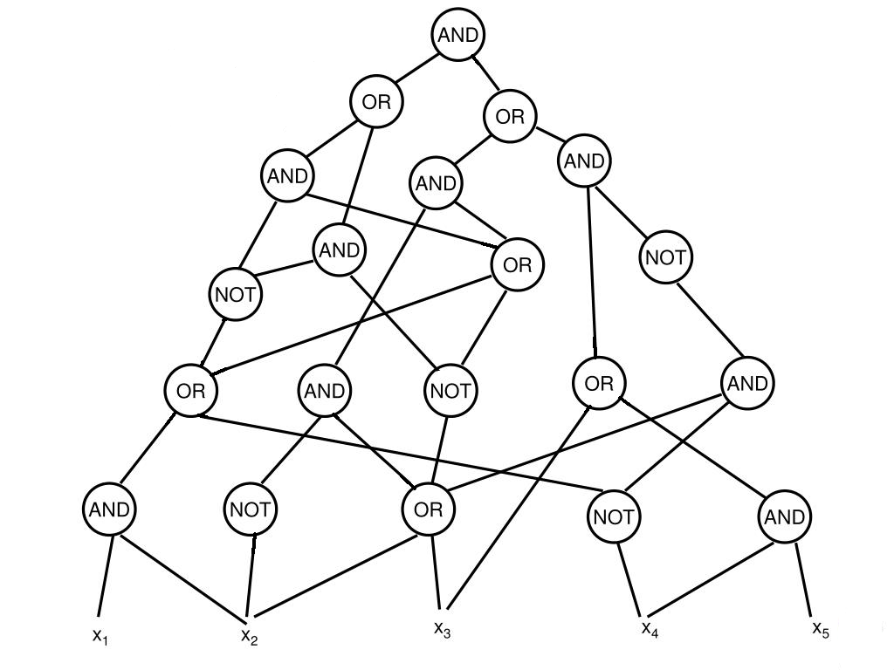

# Minisat-based Circuit-SAT-solver
<p align="center">
    
</p>

## Description
In theoretical computer science, the circuit satisfiability problem (also known as Circuit-SAT) is the decision problem of determining whether a given Boolean circuit has an assignment of its inputs that makes the output true. In other words, it asks whether the inputs to a given Boolean circuit can be consistently set to 1 or 0 such that the circuit outputs 1. If that is the case, the circuit is called *satisfiable*. Otherwise, the circuit is called *unsatisfiable*. The Circuit-SAT problem can be solved using SAT-solvers.

Minisat is a very well-known SAT-solver. It is small, complete and efficient. This project is a Minisat-based Circuit-SAT-solver. It applies the Zeitin transformation and has support for a number of circuit-based heuristics that can be easily configured.

### Building
```
(circuitsat-sat-minisat)$ mkdir build
(circuitsat-sat-minisat)$ cd build
(circuitsat-sat-minisat/build)$ cmake ..
(circuitsat-sat-minisat/build)$ cmake --build .
```
### Using: